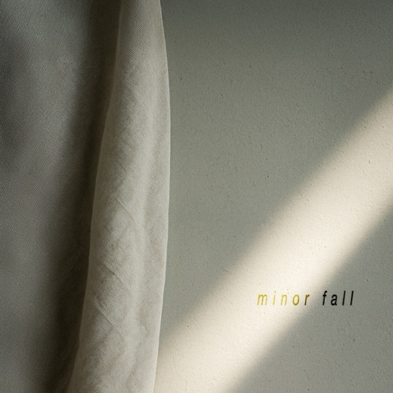

**Fractal Fade** is a faceless ambient music project by [Eman Safavi](https://emansafavi.com). It exists outside the traditional music momentum—favoring **generative systems**, **modular synthesis**, and **tape-style degradation** over structured composition.

Minor Fall, the debut EP, is a slow drift. Built mostly with self-generating patches recorded in real time and post-processed for nuance. It’s meant for headphones, late nights, deep work, and long walks.

  
 
---

## Latest Release: *Minor Fall*

**Released:** May 2025  
**Length:** 4 tracks / 14 mins  

---

## Listen Now!

>

<iframe style="border-radius:12px" src="https://open.spotify.com/embed/artist/0O4sSQGfDky11HTKNO9fbq?utm_source=generator" width="700px" height="352" frameBorder="0" allowfullscreen="" allow="autoplay; clipboard-write; encrypted-media; fullscreen; picture-in-picture" loading="lazy"></iframe>

## Also available on Bandcamp

<iframe style="border: 0; width: 100%; max-width: 700px; height: 274px; border-radius:12px;" src="https://bandcamp.com/EmbeddedPlayer/album=3327413038/size=large/bgcol=333333/linkcol=e32c14/artwork=small/transparent=true/" seamless><a href="https://fractalfade.bandcamp.com/album/minor-fall">Minor Fall by Fractal Fade</a></iframe>

  Prefer Bandcamp? <a href="https://fractalfade.bandcamp.com/album/minor-fall" target="_blank" rel="noopener">Buy on Bandcamp</a>.

---

## Vision

Fractal Fade is about minimal identity and maximal texture. No face, no stories. Just sound that evolves on its own. Current areas of experimentation include:

- Self-generating modular systems
- Tape saturation and decay
- Long-form ambient installations
- DSP tool design and algorithmic patching

---

## Links

- [Instagram](https://instagram.com/fractal_fade)
- [YouTube](https://youtube.com/@FractalFade)
- [Bandcamp](https://fractalfade.bandcamp.com)
- [Linktree](https://linktr.ee/fractalfade)

---

## Contact

For collaborations or licensing:  
**fractalfade@gmail.com**

---

*This project is independent and self-funded. If you wish to support future releases, [donations are open here](https://www.gofundme.com/f/support-fractal-fade-independent-ambient-music) or consider purchasing via Bandcamp.*

